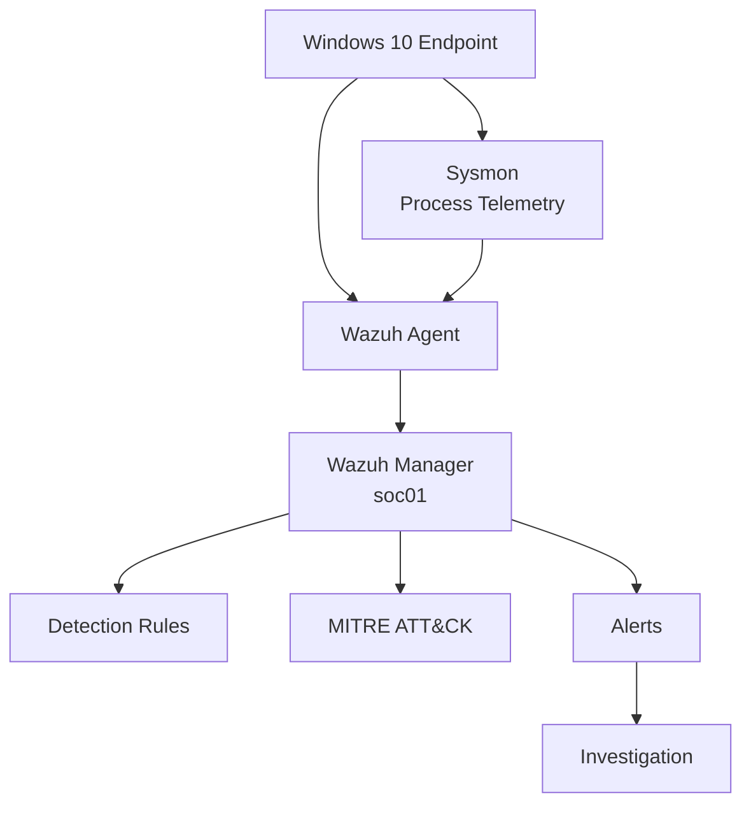

# SOC Blue Team Home Lab

Laboratório prático de **Blue Team / Security Operations Center (SOC)** desenvolvido para estudar monitoramento, detecção, investigação e triagem de eventos de segurança.

O ambiente utiliza **Windows, Sysmon e Wazuh** para gerar e analisar telemetria de endpoint, criar regras customizadas, correlacionar eventos e praticar workflows semelhantes aos encontrados em operações reais de SOC.

---

## Objetivos

- Coletar telemetria de endpoints Windows
- Integrar Sysmon ao Wazuh
- Monitorar Windows Event Logs
- Criar e testar regras customizadas
- Mapear detecções ao MITRE ATT&CK
- Investigar processos usando `ProcessGuid`
- Correlacionar processos usando `ParentProcessGuid`
- Reconstruir árvores de processos
- Praticar triagem SOC N1
- Automatizar tarefas de investigação
- Documentar troubleshooting e tuning de telemetria

---

## Arquitetura atual



### Fluxo de telemetria

```text
Windows
   ↓
Sysmon
   ↓
Wazuh Agent
   ↓
Wazuh Manager
   ↓
Detection Rules
   ↓
Alert
   ↓
Investigation
```

---

## Componentes atuais

### Endpoint

- Windows 10
- Sysmon
- Wazuh Agent
- PowerShell Script Block Logging
- Windows Event Logs

### SOC Server

- Ubuntu Server
- Wazuh Manager
- Wazuh Dashboard
- Custom Detection Rules
- Alert investigation
- Bash investigation tooling

---

## Sysmon + Wazuh

O **Sysmon** fornece telemetria detalhada do endpoint, incluindo:

- criação de processos;
- linha de comando;
- processo pai;
- usuário;
- nível de integridade;
- hashes;
- `ProcessGuid`;
- `ParentProcessGuid`;
- conexões de rede;
- consultas DNS;
- criação de arquivos.

O **Wazuh Agent** coleta os eventos e os encaminha ao Wazuh Manager.

O **Wazuh Manager** realiza:

- parsing;
- aplicação de regras;
- atribuição de severidade;
- mapeamento MITRE ATT&CK;
- geração de alertas;
- suporte à investigação.

Fluxo:

```text
Sysmon
   ↓
Wazuh Agent
   ↓
Wazuh Manager
   ↓
Rules
   ↓
MITRE ATT&CK
   ↓
Alerts
```

---

# Detecções customizadas

As seguintes regras foram desenvolvidas durante o laboratório:

| Rule | Level | Descrição |
|---|---:|---|
| 100100 | 10 | PowerShell Script Block test detection |
| 100110 | 8 | PowerShell spawning CMD with High integrity |
| 100120 | 10 | Elevated PowerShell spawning CMD and executing whoami |
| 100130 | 12 | Multiple Windows discovery commands from elevated PowerShell |

---

## Rule 100100

Detecção baseada em **PowerShell Script Block Logging — Event ID 4104**.

MITRE ATT&CK:

```text
T1059.001 - PowerShell
```

Objetivo:

Validar a integração:

```text
PowerShell
   ↓
Windows Event Log
   ↓
Wazuh Agent
   ↓
Wazuh Manager
   ↓
Custom Rule
```

---

## Rule 100110

Detecta:

```text
PowerShell
   ↓
cmd.exe
   ↓
IntegrityLevel = High
```

Baseada na regra nativa:

```text
92004
Powershell process spawned Windows command shell instance
```

MITRE ATT&CK:

```text
T1059.003 - Windows Command Shell
```

---

## Rule 100120

Adiciona contexto de **Discovery**.

Detecção:

```text
PowerShell
   ↓
cmd.exe
   ↓
High Integrity
   ↓
whoami
```

MITRE ATT&CK:

```text
T1033      - System Owner/User Discovery
T1059.003  - Windows Command Shell
```

---

## Rule 100130

Detecta múltiplas ações de discovery executadas na mesma sequência:

```text
whoami
hostname
ipconfig
net user
```

Fluxo:

```text
PowerShell
   ↓
cmd.exe
   ↓
High Integrity
   ↓
whoami
hostname
ipconfig
net user
   ↓
Rule 100130
Level 12
```

MITRE ATT&CK:

```text
T1033      - System Owner/User Discovery
T1016      - System Network Configuration Discovery
T1087.001  - Local Account
T1059.003  - Windows Command Shell
```

---

# Caso de uso: Discovery

Foi executada uma sequência controlada:

```cmd
whoami && hostname && ipconfig && net user
```

O Sysmon registrou o processo utilizando:

```text
Event ID 1 - Process Create
```

A telemetria continha:

- `ProcessGuid`
- `ProcessId`
- `Image`
- `CommandLine`
- `User`
- `IntegrityLevel`
- `Hashes`
- `ParentProcessGuid`
- `ParentImage`
- `ParentCommandLine`

---

## Process Tree observada

A investigação permitiu reconstruir:

```text
powershell.exe
└── cmd.exe [Rule 100130 | Level 12]
    ├── whoami.exe [Rule 92032 | Level 3]
    ├── HOSTNAME.EXE [Rule 92032 | Level 3]
    ├── ipconfig.exe [Rule 92032 | Level 3]
    └── net.exe [Rule 92036 | Level 3]
        └── net1.exe [Rule 92031 | Level 3]
```

Isso demonstrou a correlação entre:

```text
ProcessGuid
     +
ParentProcessGuid
     ↓
Process Tree
```

---

# Process Tree Investigation

Durante a investigação, inicialmente foi utilizado `jq` diretamente no arquivo:

```text
/var/ossec/logs/alerts/alerts.json
```

Exemplo de busca por processos filhos:

```bash
sudo jq -c '
select(
  .data.win.eventdata.parentProcessGuid ==
  "{PROCESS-GUID}"
)
|
{
  rule: .rule.id,
  description: .rule.description,
  processGuid: .data.win.eventdata.processGuid,
  image: .data.win.eventdata.image,
  commandLine: .data.win.eventdata.commandLine,
  parentImage: .data.win.eventdata.parentImage
}' /var/ossec/logs/alerts/alerts.json
```

---

# Automação da investigação

Para evitar reconstruir manualmente a árvore de processos em cada investigação, foi desenvolvido:

```text
scripts/process-tree.sh
```

A ferramenta permite consultar eventos utilizando:

- ProcessGuid
- Rule ID
- alertas atuais;
- alertas históricos;
- janela temporal;
- árvore recursiva;
- visão resumida;
- relatório de triagem.

---

## Investigar por ProcessGuid

```bash
./scripts/process-tree.sh '{PROCESS-GUID}'
```

---

## Investigar pelo Rule ID

```bash
./scripts/process-tree.sh --rule 100130
```

O utilitário procura automaticamente o alerta mais recente correspondente à regra.

---

## Modo resumido

```bash
./scripts/process-tree.sh --rule 100130 --summary
```

Exemplo:

```text
powershell.exe
└── cmd.exe [Rule 100130 | L12]
    ├── whoami.exe [Rule 92032 | L3]
    ├── HOSTNAME.EXE [Rule 92032 | L3]
    ├── ipconfig.exe [Rule 92032 | L3]
    └── net.exe [Rule 92036 | L3]
        └── net1.exe [Rule 92031 | L3]
```

---

## Investigação histórica

Durante os testes foi identificado que alertas antigos deixavam de aparecer em:

```text
/var/ossec/logs/alerts/alerts.json
```

Isso ocorreu devido ao processo de **log rotation do Wazuh**.

Os eventos históricos estavam armazenados em:

```text
/var/ossec/logs/alerts/YYYY/Mon/ossec-alerts-DD.json
```

A ferramenta foi então modificada para pesquisar:

```text
alerts.json atual
        +
ossec-alerts-*.json históricos
```

Exemplo:

```bash
./scripts/process-tree.sh --rule 100130 --days 7 --summary
```

---

## SOC Triage Report

A ferramenta também gera automaticamente um relatório de triagem:

```bash
./scripts/process-tree.sh --rule 100130 --days 7 --report
```

Exemplo:

```text
============================================================
                    SOC TRIAGE REPORT
============================================================

[ALERT]
Rule ID:      100130
Level:        12
Host:         WIN10
User:         WIN10\vboxuser

[DETECTION]
Multiple Windows discovery commands executed
from elevated PowerShell.

[MITRE ATT&CK]
T1033
T1016
T1087.001
T1059.003

[PROCESS TREE]

powershell.exe
└── cmd.exe
    ├── whoami.exe
    ├── HOSTNAME.EXE
    ├── ipconfig.exe
    └── net.exe
        └── net1.exe
```

---

# Triagem SOC N1

O cenário foi classificado como:

```text
Classification:
True Positive

Disposition:
Close - Authorized Security Test
```

A atividade foi detectada corretamente, porém fazia parte de um teste controlado dentro do laboratório.

Isso demonstra uma distinção importante:

```text
True Positive
      ≠
Confirmed Malicious Activity
```

Uma detecção pode ser tecnicamente correta e ainda representar uma atividade legítima ou autorizada.

O contexto continua sendo necessário antes de classificar um evento como incidente.

---

# Troubleshooting

Durante a implementação foram encontrados problemas reais de operação.

## Sysmon Event Flood

A configuração inicial do Sysmon produziu grande volume de eventos, principalmente relacionados ao Registry.

O Wazuh Agent chegou a informar:

```text
Agent buffer is 90% full
Agent buffer is full
```

Foi realizado tuning da configuração do Sysmon, reduzindo eventos desnecessários.

Após o ajuste:

```text
Agent buffer is under 70%.
Working properly again.
```

---

## Log Rotation

Inicialmente a ferramenta consultava somente:

```text
alerts.json
```

Alertas históricos não eram encontrados.

Depois foi identificado que o Wazuh realizava rotação para:

```text
ossec-alerts-DD.json
```

A ferramenta foi modificada para consultar ambos.

---

## Arquivos Wazuh e permissões

O usuário `socadmin` não possui acesso direto a determinados arquivos do Wazuh.

Por isso, algumas operações utilizam:

```bash
sudo
```

em vez de alterar indevidamente as permissões dos diretórios do Wazuh.

---

# Estrutura do projeto

```text
soc-blue-team-homelab/
│
├── README.md
│
├── .gitignore
│
├── cases/
│   └── case-100130-discovery.txt
│
├── docs/
│   └── process-tree-investigation.md
│
├── evidence/
│
├── scripts/
│   ├── process-tree.sh
│   └── process-tree-v1.0.sh
│
└── wazuh/
    └── rules/
        └── local_rules.xml
```

---

# Status do Home Lab

## Concluído

- Wazuh Manager deployment
- Windows Wazuh Agent
- Windows Event Log collection
- PowerShell Script Block Logging
- Sysmon installation
- Sysmon + Wazuh integration
- Sysmon telemetry tuning
- Sysmon Event ID 1 monitoring
- Custom Wazuh detection rules
- MITRE ATT&CK mapping
- Discovery detection
- ProcessGuid investigation
- ParentProcessGuid correlation
- Recursive process tree reconstruction
- Historical alert investigation
- SOC triage reporting
- Bash investigation automation

---

## Próximas etapas

O laboratório continuará evoluindo com:

- Novos casos de detecção
- Windows authentication monitoring
- Failed login detection
- Brute-force detection
- Windows Server monitoring
- Active Directory monitoring
- Correlação entre endpoints
- Network telemetry
- Suricata
- Zeek
- Incident investigation
- Threat hunting

---

# Disclaimer

Todos os testes apresentados neste projeto são realizados em **ambiente de laboratório controlado e autorizado**.

O conteúdo tem finalidade exclusivamente educacional e defensiva.
