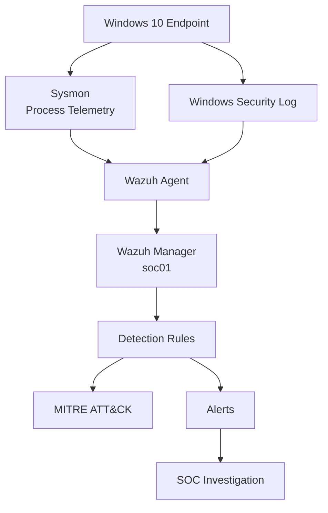

# SOC Blue Team Home Lab

Laboratório prático de Blue Team e Security Operations Center (SOC), desenvolvido para estudo de monitoramento, detecção, correlação de eventos, investigação e triagem de incidentes utilizando ferramentas como Wazuh, Sysmon e Windows Security Event Log.

O projeto foi construído em ambiente virtualizado e documenta não apenas as detecções finais, mas também os testes, troubleshooting e decisões tomadas durante a implementação.

---

# Objetivos

Este laboratório tem como objetivos:

- desenvolver experiência prática em operações de SOC;
- compreender geração, coleta e análise de logs;
- trabalhar com telemetria de endpoints Windows;
- criar e testar regras de detecção;
- realizar correlação temporal de eventos;
- investigar árvores de processos;
- detectar falhas de autenticação e possíveis ataques de brute force;
- utilizar MITRE ATT&CK para classificação de comportamento;
- realizar triagem de alertas;
- documentar casos de investigação;
- desenvolver pequenas ferramentas para auxiliar atividades de SOC.

---

# Arquitetura do Laboratório



---

# Ambiente

## Host

```text
Sistema: Windows 11
Virtualização: VirtualBox
```

## Wazuh Server

```text
Hostname: soc01
Sistema: Ubuntu Server 24.04
IP Host-Only: 192.168.100.10
Wazuh: 4.14.7
```

## Windows Endpoint

```text
Sistema: Windows 10
IP Host-Only: 192.168.100.20
Wazuh Agent: ativo
Sysmon: ativo
```

---

# Componentes

O laboratório atualmente utiliza:

- Windows 10
- Ubuntu Server
- Wazuh Manager
- Wazuh Agent
- Wazuh Dashboard
- Sysmon
- Windows Security Event Log
- PowerShell Logging
- Bash
- jq
- MITRE ATT&CK
- Git
- GitHub

---

# Sysmon + Wazuh

O Sysmon foi configurado no endpoint Windows para fornecer telemetria detalhada de processos e outras atividades do sistema.

Entre os eventos utilizados no laboratório estão:

```text
Event ID 1  - Process Create
Event ID 3  - Network Connection
Event ID 11 - File Create
Event ID 22 - DNS Query
```

O Event ID 1 é especialmente importante para investigação porque fornece informações como:

```text
ProcessGuid
ProcessId
Image
CommandLine
CurrentDirectory
User
IntegrityLevel
Hashes
ParentProcessGuid
ParentProcessId
ParentImage
ParentCommandLine
```

O Wazuh Agent coleta esses eventos e os envia ao Wazuh Manager para análise e aplicação das regras de detecção.

---

# PowerShell Monitoring

O laboratório também utiliza PowerShell Script Block Logging.

Foi validada a coleta de:

```text
Microsoft-Windows-PowerShell/Operational
Event ID 4104
```

Uma regra customizada foi criada para detectar um marcador utilizado durante testes controlados:

```text
Rule ID: 100100
Level:   10
MITRE:   T1059.001
```

---

# Custom Detection Rules

As regras customizadas são mantidas em:

```text
wazuh/rules/local_rules.xml
```

Atualmente o laboratório possui as seguintes regras principais.

---

## Rule 100100

Detecção de PowerShell Script Block contendo marcador de teste controlado.

```text
Rule ID: 100100
Level:   10
MITRE:   T1059.001
```

MITRE ATT&CK:

```text
T1059.001 - PowerShell
```

---

## Rule 100110

Detecta `cmd.exe` iniciado por PowerShell elevado.

```text
Rule ID: 100110
Level:   8
```

Condições utilizadas incluem:

```text
ParentImage = powershell.exe
Image = cmd.exe
IntegrityLevel = High
```

MITRE ATT&CK:

```text
T1059.003 - Windows Command Shell
```

---

## Rule 100120

Detecta execução de `whoami` dentro de um `cmd.exe` iniciado por PowerShell elevado.

```text
Rule ID: 100120
Level:   10
```

MITRE ATT&CK:

```text
T1033     - System Owner/User Discovery
T1059.003 - Windows Command Shell
```

---

## Rule 100130

Detecta múltiplos comandos de Discovery executados dentro do mesmo `cmd.exe`.

Comandos monitorados:

```text
whoami
hostname
ipconfig
net user
```

Regra:

```text
Rule ID: 100130
Level:   12
```

MITRE ATT&CK:

```text
T1033     - System Owner/User Discovery
T1016     - System Network Configuration Discovery
T1087.001 - Local Account
T1059.003 - Windows Command Shell
```

---

# Discovery Detection Scenario

Um cenário controlado foi executado com:

```cmd
cmd.exe /c "whoami && hostname && ipconfig && net user"
```

O processo foi iniciado a partir de uma sessão elevada do PowerShell.

O Wazuh gerou:

```text
Rule ID: 100130
Level:   12
```

A cadeia observada foi:

```text
powershell.exe
└── cmd.exe
    ├── whoami.exe
    ├── HOSTNAME.EXE
    ├── ipconfig.exe
    └── net.exe
        └── net1.exe
```

---

# Process Tree Investigation

A investigação de processos utiliza:

```text
ProcessGuid
ParentProcessGuid
```

Esses campos permitem relacionar processos pai e filhos com mais confiabilidade do que utilizar apenas PID.

Exemplo:

```text
powershell.exe
└── cmd.exe [Rule 100130 | L12]
    ├── whoami.exe [Rule 92032 | L3]
    ├── HOSTNAME.EXE [Rule 92032 | L3]
    ├── ipconfig.exe [Rule 92032 | L3]
    └── net.exe [Rule 92036 | L3]
        └── net1.exe [Rule 92031 | L3]
```

A documentação completa desta etapa está disponível em:

```text
docs/process-tree-investigation.md
```

---

# Process Tree Investigation Utility

Foi desenvolvida uma ferramenta em Bash para automatizar parte da investigação de árvores de processos.

Arquivo:

```text
scripts/process-tree.sh
```

A ferramenta permite investigar utilizando:

```text
ProcessGuid
Rule ID
```

Exemplos:

```bash
./scripts/process-tree.sh --rule 100130 --days 7 --summary
```

```bash
./scripts/process-tree.sh --rule 100130 --days 7 --report
```

Também é possível investigar utilizando diretamente um ProcessGuid.

---

## Funcionalidades

A ferramenta atualmente possui:

- pesquisa por ProcessGuid;
- pesquisa por Rule ID;
- reconstrução recursiva de processos filhos;
- correlação por `ProcessGuid` e `ParentProcessGuid`;
- consulta ao `alerts.json`;
- consulta aos históricos `ossec-alerts-*.json`;
- definição de janela temporal com `--days`;
- modo resumido com `--summary`;
- geração de relatório com `--report`;
- tratamento de linhas JSON inválidas ou incompletas;
- suporte à rotação de logs do Wazuh.

---

# Wazuh Log Rotation

Durante a investigação foi identificado que alertas antigos deixam o arquivo:

```text
/var/ossec/logs/alerts/alerts.json
```

e passam para arquivos históricos como:

```text
/var/ossec/logs/alerts/2026/Aug/ossec-alerts-22.json
/var/ossec/logs/alerts/2026/Aug/ossec-alerts-24.json
```

A ferramenta de investigação foi adaptada para pesquisar tanto:

```text
alerts.json
```

quanto:

```text
ossec-alerts-*.json
```

Isso permite reconstruir árvores de processos mesmo após a rotação dos logs.

---

# SOC Triage Report

A ferramenta também pode gerar um relatório inicial de triagem.

Exemplo:

```bash
./scripts/process-tree.sh --rule 100130 --days 7 --report
```

Estrutura:

```text
============================================================
                    SOC TRIAGE REPORT
============================================================

[ALERT]

Rule ID
Level
Host
IP
User
Timestamp
ProcessGuid

[DETECTION]

Description

[MITRE ATT&CK]

Techniques

[PROCESS]

Image
Parent
Parent GUID
User
Integrity
CommandLine
Hashes

[PROCESS TREE]

Process hierarchy

[ANALYST ASSESSMENT]

Classification
Disposition
Notes
```

---

# Discovery Case Triage

O cenário da Rule 100130 foi classificado como:

```text
Classification: True Positive
Disposition: Close - Authorized Security Test
```

A atividade foi realmente detectada, porém foi executada intencionalmente dentro do laboratório.

Isso demonstra uma distinção importante:

```text
True Positive != Confirmed Malicious Incident
```

O contexto continua sendo necessário durante a triagem.

Case:

```text
cases/case-100130-discovery.txt
```

---

# Windows Authentication Monitoring

Foi implementado monitoramento de falhas de autenticação utilizando o Windows Security Event Log e o Wazuh.

O principal evento utilizado foi:

```text
Event ID 4625
An account failed to log on
```

Campos importantes:

```text
targetUserName
targetDomainName
logonType
ipAddress
status
subStatus
```

---

# Rule 60122 - Individual Logon Failure

Uma tentativa de autenticação inválida gera:

```text
Event ID: 4625
```

No primeiro cenário foi utilizada uma conta inexistente.

Resultado no Windows:

```text
Account:     SOC-LAB-INVALID
Logon Type:  3
Source IP:   127.0.0.1
Status:      0xC000006D
SubStatus:   0xC0000064
```

Interpretação:

```text
0xC000006D = Logon failure
0xC0000064 = User does not exist
```

No Wazuh:

```text
Rule ID:     60122
Level:       5
Description: Logon Failure - Unknown user or bad password
```

---

# Rule 60204 - Multiple Windows Logon Failures

O Wazuh possui uma correlação nativa para múltiplas falhas de autenticação.

A lógica encontrada no ruleset é:

```xml
<rule id="60204" level="10" frequency="$MS_FREQ" timeframe="240">
  <if_matched_group>authentication_failed</if_matched_group>
  <same_field>win.eventdata.ipAddress</same_field>
  <description>Multiple Windows Logon Failures</description>
  <mitre>
    <id>T1110</id>
  </mitre>
</rule>
```

A variável utilizada pelo ruleset é:

```xml
<var name="MS_FREQ">8</var>
```

Portanto:

```text
8 falhas
+
mesmo IP
+
até 240 segundos
=
Rule 60204
```

Resultado:

```text
Rule ID:     60204
Level:       10
Description: Multiple Windows Logon Failures
MITRE:       T1110
Technique:   Brute Force
Tactic:      Credential Access
```

---

# Password Guessing Detection

Além da regra nativa, foram desenvolvidas regras customizadas para identificar password guessing direcionado contra uma mesma conta.

---

## Rule 100135

A Rule 100135 funciona como filtro intermediário.

Ela identifica:

```text
Event ID 4625
+
conta existente
+
senha incorreta
```

Regra:

```xml
<rule id="100135" level="6">
  <if_sid>60122</if_sid>
  <field name="win.eventdata.subStatus" type="pcre2">(?i)^0xc000006a$</field>
  <description>SOC LAB: Windows logon failure caused by incorrect password for an existing account.</description>
  <group>authentication_failed,password_failure,soc_lab,</group>
</rule>
```

O SubStatus:

```text
0xC000006A
```

representa senha incorreta para uma conta existente.

---

## Rule 100140

A Rule 100140 realiza a correlação temporal das falhas filtradas pela Rule 100135.

```xml
<rule id="100140" level="12" frequency="5" timeframe="60">
  <if_matched_sid>100135</if_matched_sid>
  <same_field>win.eventdata.targetUserName</same_field>
  <same_field>win.eventdata.ipAddress</same_field>
  <description>SOC LAB: Repeated password failures against the same Windows account from the same source IP.</description>
  <group>authentication_failed,brute_force,password_guessing,soc_lab,</group>
  <mitre>
    <id>T1110.001</id>
  </mitre>
</rule>
```

Critérios:

```text
5 falhas
+
mesmo usuário
+
mesmo IP
+
até 60 segundos
+
senha incorreta
+
conta existente
=
Rule 100140
```

MITRE ATT&CK:

```text
T1110.001 - Password Guessing
Tactic: Credential Access
```

---

# Password Guessing Validation

Foram realizadas cinco tentativas de senha incorreta contra:

```text
WIN10\vboxuser
```

O Windows registrou:

```text
Event ID:   4625
Status:     0xC000006D
SubStatus:  0xC000006A
```

Resultado no Wazuh:

```text
1ª falha -> Rule 100135 | Level 6
2ª falha -> Rule 100135 | Level 6
3ª falha -> Rule 100135 | Level 6
4ª falha -> Rule 100135 | Level 6
5ª falha -> Rule 100140 | Level 12
```

Alerta final:

```text
Rule ID:      100140
Level:        12
User:         vboxuser
Source IP:    127.0.0.1
Status:       0xC000006D
SubStatus:    0xC000006A
MITRE:        T1110.001
Technique:    Password Guessing
Tactic:       Credential Access
```

---

# Correlation Rule Troubleshooting

Durante o desenvolvimento foi identificado um comportamento importante.

Inicialmente a `100140` fazia correlação diretamente sobre:

```xml
<if_matched_sid>60122</if_matched_sid>
```

Com essa configuração, foi observado que a regra customizada interferia no disparo da regra nativa `60204`.

Teste observado:

```text
100140 ativa
+
8 usuários diferentes
+
mesmo IP
=
60204 não disparou
```

A `100140` foi então temporariamente desabilitada.

Novo teste:

```text
100140 desabilitada
+
8 usuários diferentes
+
mesmo IP
=
60204 disparou
```

Para evitar a competição direta entre as correlações, foi criada a regra intermediária `100135`.

Arquitetura final:

```text
Windows Event ID 4625
        |
        v
60122 | Level 5
        |
        +-----------------------------+
        |                             |
        v                             v
60204 | Level 10                100135 | Level 6
8 failures                     wrong password
same IP                        existing account
240 seconds                           |
T1110                                 v
                               100140 | Level 12
                               5 failures
                               same user
                               same IP
                               60 seconds
                               T1110.001
```

Após essa alteração, as duas lógicas passaram a coexistir corretamente.

---

# Final Authentication Validation

## Scenario 1 - Password Guessing

```text
Target:      vboxuser
Failures:    5
Source IP:   127.0.0.1
Status:      0xC000006D
SubStatus:   0xC000006A
```

Resultado:

```text
100140
Level 12
T1110.001
Password Guessing
```

---

## Scenario 2 - Multiple Logon Failures

Foram utilizados oito usuários diferentes:

```text
SOC-SPRAY3-01
SOC-SPRAY3-02
SOC-SPRAY3-03
SOC-SPRAY3-04
SOC-SPRAY3-05
SOC-SPRAY3-06
SOC-SPRAY3-07
SOC-SPRAY3-08
```

Todos originados de:

```text
127.0.0.1
```

Resultado:

```text
60204
Level 10
T1110
Brute Force
```

A `100140` não foi acionada nesse cenário.

Isso confirmou a coexistência das duas detecções:

```text
Different users + same IP
        |
        v
60204
Brute Force

Same user + same IP + wrong password
        |
        v
100140
Password Guessing
```

---

# Authentication Case Triage

O cenário da Rule 100140 foi classificado como:

```text
Classification: True Positive
Disposition: Close - Authorized Security Test
```

A detecção representa corretamente o comportamento observado, porém as tentativas foram geradas intencionalmente no laboratório.

Case:

```text
cases/case-100140-password-guessing.txt
```

Documentação completa:

```text
docs/windows-authentication-monitoring.md
```

---

# MITRE ATT&CK Coverage

As principais técnicas trabalhadas até o momento são:

| Technique | Description |
|---|---|
| T1059.001 | PowerShell |
| T1059.003 | Windows Command Shell |
| T1033 | System Owner/User Discovery |
| T1016 | System Network Configuration Discovery |
| T1087.001 | Local Account |
| T1110 | Brute Force |
| T1110.001 | Password Guessing |

---

# Project Structure

```text
soc-blue-team-homelab/
│
├── README.md
│
├── .gitignore
│
├── cases/
│   ├── case-100130-discovery.txt
│   └── case-100140-password-guessing.txt
│
├── docs/
│   ├── process-tree-investigation.md
│   └── windows-authentication-monitoring.md
│
├── scripts/
│   └── process-tree.sh
│
└── wazuh/
    └── rules/
        └── local_rules.xml
```

---

# Current Detection Flow

```text
Windows Endpoint
      |
      +---- Sysmon
      |       |
      |       +---- Process Creation
      |       +---- Process Tree
      |       +---- Discovery Detection
      |
      +---- Security Event Log
              |
              +---- Event ID 4625
              +---- Authentication Failures
              +---- Brute Force
              +---- Password Guessing
                     |
                     v
                 Wazuh Agent
                     |
                     v
                 Wazuh Manager
                     |
                     v
               Detection Rules
                     |
                     v
                MITRE ATT&CK
                     |
                     v
                  Alerts
                     |
                     v
                 SOC Triage
```

---

# Troubleshooting Performed

Durante o desenvolvimento foram investigados e resolvidos problemas relacionados a:

- instalação do Wazuh Agent;
- comunicação entre endpoint e Wazuh Manager;
- configuração de Sysmon;
- excesso de eventos Sysmon;
- ajuste de Registry Events;
- coleta de PowerShell;
- criação de regras customizadas;
- sintaxe XML de regras Wazuh;
- correlação por `ProcessGuid`;
- reconstrução de árvores de processos;
- rotação de logs do Wazuh;
- arquivos JSON incompletos durante leitura;
- consultas com `jq`;
- correlação temporal;
- `frequency`;
- `timeframe`;
- `same_field`;
- diferenças entre usuário inexistente e senha incorreta;
- interação entre regras customizadas e regras nativas de correlação.

---

# Status

Implementado:

```text
[OK] Wazuh Manager
[OK] Windows Wazuh Agent
[OK] Sysmon
[OK] PowerShell Logging
[OK] Sysmon Event ID 1 investigation
[OK] ProcessGuid correlation
[OK] ParentProcessGuid correlation
[OK] Custom Wazuh detection rules
[OK] Discovery detection
[OK] Process Tree reconstruction
[OK] Historical Wazuh alert investigation
[OK] SOC Triage Report
[OK] Windows Event ID 4625 monitoring
[OK] Individual authentication failure detection
[OK] Multiple Windows logon failure detection
[OK] Password Guessing detection
[OK] Temporal correlation
[OK] MITRE ATT&CK mapping
```

---

# Next Steps

Próximas evoluções previstas para o laboratório:

- Windows Event ID 4624 analysis;
- comparação entre Logon Types;
- account lockout monitoring;
- Event ID 4740;
- successful logon after multiple failures;
- detection correlation between failed and successful authentication;
- RDP authentication monitoring;
- lateral movement scenarios;
- Windows Server integration;
- Suricata;
- Zeek;
- network telemetry;
- additional SOC investigation cases.

---

# Disclaimer

Todos os testes presentes neste projeto foram realizados em ambiente controlado e de laboratório.

Os comandos, regras e técnicas documentados têm finalidade exclusivamente educacional, voltada ao estudo de:

- Blue Team;
- SOC;
- SIEM;
- Detection Engineering;
- Threat Hunting;
- DFIR;
- Cybersecurity.

Nenhum dos testes descritos deve ser executado em sistemas ou redes sem autorização.

