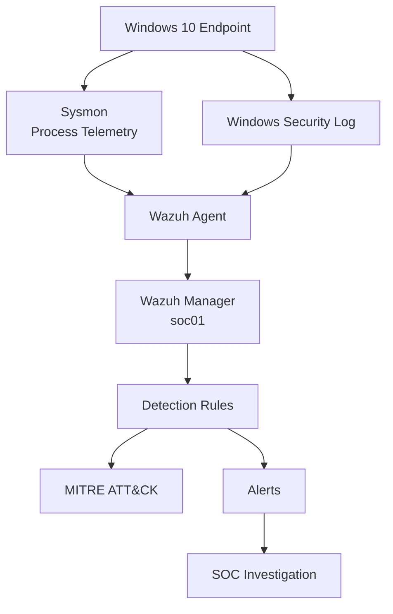

# SOC Blue Team Home Lab

Laboratório prático de Blue Team e Security Operations Center (SOC), desenvolvido para estudo de monitoramento, detecção, correlação de eventos, investigação e triagem de incidentes utilizando Wazuh, Sysmon, Windows Security Event Log e ferramentas auxiliares.

O projeto foi construído em ambiente virtualizado e documenta não apenas as detecções finais, mas também os testes, troubleshooting e decisões tomadas durante a implementação.

---

# Objetivos

Este laboratório tem como objetivos:

- desenvolver experiência prática em operações de SOC;
- compreender geração, coleta e análise de logs;
- trabalhar com telemetria de endpoints Windows;
- criar e testar regras de detecção;
- realizar correlação temporal de eventos;
- investigar árvores de processos;
- detectar falhas de autenticação;
- detectar brute force e password guessing;
- correlacionar falhas de autenticação com logons bem-sucedidos;
- detectar bloqueio de contas;
- correlacionar password guessing com account lockout;
- utilizar MITRE ATT&CK para classificação de comportamento;
- realizar triagem de alertas;
- documentar casos de investigação;
- desenvolver pequenas ferramentas para auxiliar atividades de SOC.

---

# Arquitetura do Laboratório



---

# Ambiente

## Host

```text
Sistema: Windows 11
Virtualização: VirtualBox
```

## Wazuh Server

```text
Hostname: soc01
Sistema: Ubuntu Server 24.04
IP Host-Only: 192.168.100.10
Wazuh: 4.14.7
```

## Windows Endpoint

```text
Sistema: Windows 10
IP Host-Only: 192.168.100.20
Wazuh Agent: ativo
Sysmon: ativo
```

---

# Componentes

O laboratório atualmente utiliza:

- Windows 10
- Ubuntu Server
- Wazuh Manager
- Wazuh Agent
- Wazuh Dashboard
- Sysmon
- Windows Security Event Log
- PowerShell Logging
- Bash
- jq
- MITRE ATT&CK
- Git
- GitHub

---

# Sysmon + Wazuh

O Sysmon foi configurado no endpoint Windows para fornecer telemetria detalhada de processos e outras atividades do sistema.

Entre os eventos utilizados no laboratório estão:

```text
Event ID 1  - Process Create
Event ID 3  - Network Connection
Event ID 11 - File Create
Event ID 22 - DNS Query
```

O Event ID 1 fornece informações importantes para investigação, incluindo:

```text
ProcessGuid
ProcessId
Image
CommandLine
CurrentDirectory
User
IntegrityLevel
Hashes
ParentProcessGuid
ParentProcessId
ParentImage
ParentCommandLine
```

---

# PowerShell Monitoring

Foi validada a coleta de:

```text
Microsoft-Windows-PowerShell/Operational
Event ID 4104
```

Regra customizada:

```text
Rule ID: 100100
Level:   10
MITRE:   T1059.001
```

---

# Custom Detection Rules

As regras customizadas são mantidas em:

```text
wazuh/rules/local_rules.xml
```

Principais regras implementadas:

```text
100100 - PowerShell Script Block marker detection
100110 - PowerShell spawning elevated cmd.exe
100120 - whoami executed by elevated cmd.exe
100130 - Discovery command sequence
100135 - Wrong password for existing Windows account
100140 - Password Guessing
100145 - Successful Windows network logon
100150 - Successful logon after Password Guessing
100155 - Account lockout after Password Guessing
```

---

# Discovery Detection

## Rule 100130

Detecta múltiplos comandos de Discovery dentro do mesmo fluxo de execução:

```text
whoami
hostname
ipconfig
net user
```

Resultado:

```text
Rule ID: 100130
Level:   12
```

MITRE ATT&CK:

```text
T1033     - System Owner/User Discovery
T1016     - System Network Configuration Discovery
T1087.001 - Local Account
T1059.003 - Windows Command Shell
```

Exemplo de árvore:

```text
powershell.exe
└── cmd.exe
    ├── whoami.exe
    ├── HOSTNAME.EXE
    ├── ipconfig.exe
    └── net.exe
        └── net1.exe
```

Case:

```text
cases/case-100130-discovery.txt
```

Documentação:

```text
docs/process-tree-investigation.md
```

---

# Process Tree Investigation Utility

Foi desenvolvida uma ferramenta em Bash:

```text
scripts/process-tree.sh
```

Exemplos:

```bash
./scripts/process-tree.sh --rule 100130 --days 7 --summary
```

```bash
./scripts/process-tree.sh --rule 100130 --days 7 --report
```

Funcionalidades:

- pesquisa por ProcessGuid;
- pesquisa por Rule ID;
- reconstrução recursiva de processos filhos;
- correlação por `ProcessGuid` e `ParentProcessGuid`;
- consulta ao `alerts.json`;
- consulta aos históricos `ossec-alerts-*.json`;
- janela temporal com `--days`;
- modo resumido;
- geração de relatório;
- tratamento de JSON incompleto;
- suporte à rotação de logs.

---

# Windows Authentication Monitoring

A etapa de autenticação utiliza principalmente:

```text
4625 - Failed Logon
4624 - Successful Logon
4740 - Account Locked Out
```

Documentação:

```text
docs/windows-authentication-monitoring.md
```

---

# Rule 60122 - Individual Logon Failure

Uma autenticação inválida gera:

```text
Event ID: 4625
```

Exemplo:

```text
Status:      0xC000006D
SubStatus:   0xC0000064
```

No Wazuh:

```text
Rule ID:      60122
Level:        5
Description:  Logon Failure - Unknown user or bad password
```

---

# Rule 60204 - Multiple Windows Logon Failures

A regra nativa 60204 correlaciona:

```text
8 falhas
mesmo IP
até 240 segundos
```

Resultado:

```text
Rule ID:      60204
Level:        10
MITRE:        T1110
Technique:    Brute Force
```

---

# Rule 100135 - Wrong Password for Existing Account

```xml
<rule id="100135" level="6">
  <if_sid>60122</if_sid>
  <field name="win.eventdata.subStatus" type="pcre2">(?i)^0xc000006a$</field>
  <description>SOC LAB: Windows logon failure caused by incorrect password for an existing account.</description>
  <group>authentication_failed,password_failure,soc_lab,</group>
</rule>
```

O código:

```text
0xC000006A
```

representa senha incorreta para uma conta existente.

---

# Rule 100140 - Password Guessing

```xml
<rule id="100140" level="12" frequency="5" timeframe="60">
  <if_matched_sid>100135</if_matched_sid>
  <same_field>win.eventdata.targetUserName</same_field>
  <same_field>win.eventdata.ipAddress</same_field>
  <description>SOC LAB: Repeated password failures against the same Windows account from the same source IP.</description>
  <group>authentication_failed,brute_force,password_guessing,soc_lab,</group>
  <mitre>
    <id>T1110.001</id>
  </mitre>
</rule>
```

Critérios:

```text
5 falhas
mesmo usuário
mesmo IP
até 60 segundos
```

Resultado:

```text
Rule ID:      100140
Level:        12
MITRE:        T1110.001
Technique:    Password Guessing
```

Case:

```text
cases/case-100140-password-guessing.txt
```

---

# Event ID 4624 - Successful Logon

Foram validados:

```text
Type 2 - Interactive
Type 3 - Network
```

O Type 3 foi utilizado como base para correlação com Password Guessing.

---

# Rule 100145 - Successful Network Logon

```xml
<rule id="100145" level="4">
  <if_sid>60106</if_sid>
  <field name="win.system.eventID">^4624$</field>
  <field name="win.eventdata.logonType">^3$</field>
  <description>SOC LAB: Successful Windows network logon.</description>
  <group>authentication_success,network_logon,soc_lab,</group>
  <mitre>
    <id>T1078</id>
  </mitre>
</rule>
```

MITRE:

```text
T1078 - Valid Accounts
```

---

# Rule 100150 - Successful Logon After Password Guessing

```xml
<rule id="100150" level="14" timeframe="300">
  <if_sid>100145</if_sid>
  <if_matched_sid>100140</if_matched_sid>
  <same_field>win.eventdata.targetUserName</same_field>
  <same_field>win.eventdata.ipAddress</same_field>
  <description>SOC LAB: Successful Windows network logon after repeated password guessing attempts.</description>
  <group>authentication_success,possible_account_compromise,password_guessing,soc_lab,</group>
  <mitre>
    <id>T1078</id>
  </mitre>
</rule>
```

Lógica:

```text
Password Guessing
↓
Successful Network Logon
↓
Possible Account Compromise
```

Resultado validado:

```text
Rule ID:      100150
Level:        14
User:         vboxuser
Source IP:    127.0.0.1
Logon Type:   3
MITRE:        T1078
```

Case:

```text
cases/case-100150-success-after-password-guessing.txt
```

---

# Event ID 4740 - Account Lockout

Foi configurado e validado o bloqueio de conta local.

Política utilizada:

```text
Lockout threshold:           10
Lockout duration:            10 minutes
Lockout observation window:  10 minutes
```

Uma conta dedicada foi utilizada:

```text
SOC-LAB-LOCKOUT
```

Após atingir o limite de tentativas inválidas, o Windows gerou:

```text
Event ID:      4740
User:          SOC-LAB-LOCKOUT
Description:   A user account was locked out
```

---

# Rule 60115 - User Account Locked Out

O Wazuh classificou o Event ID 4740 com a regra nativa:

```text
Rule ID:      60115
Level:        9
Description:  User account locked out (multiple login errors)
User:         SOC-LAB-LOCKOUT
```

MITRE ATT&CK:

```text
T1110 - Brute Force
T1531 - Account Access Removal
```

Táticas:

```text
Credential Access
Impact
```

---

# Rule 100155 - Account Lockout After Password Guessing

Foi criada uma correlação customizada entre:

```text
100140 - Password Guessing
↓
60115 - Account Locked Out
↓
100155 - Account Lockout After Password Guessing
```

Regra:

```xml
<rule id="100155" level="13" timeframe="300">
  <if_sid>60115</if_sid>
  <if_matched_sid>100140</if_matched_sid>
  <same_field>win.eventdata.targetUserName</same_field>

  <description>SOC LAB: Windows account locked out after repeated password guessing attempts.</description>

  <group>authentication_failed,account_lockout,password_guessing,soc_lab,</group>

  <mitre>
    <id>T1110.001</id>
    <id>T1531</id>
  </mitre>
</rule>
```

Critérios:

```text
Password Guessing previamente detectado
+
mesmo targetUserName
+
Event ID 4740
+
janela de 300 segundos
```

Resultado validado:

```text
Rule ID:      100155
Level:        13
Description:  Windows account locked out after repeated password guessing attempts.
User:         SOC-LAB-LOCKOUT
```

MITRE:

```text
T1110.001 - Password Guessing
T1531     - Account Access Removal
```

Case:

```text
cases/case-100155-account-lockout-after-password-guessing.txt
```

---

# Authentication Correlation Chains

## Password Guessing → Successful Logon

```text
4625
↓
60122
↓
100135
↓
100140
T1110.001 - Password Guessing
↓
4624 Type 3
↓
100145
↓
100150
T1078 - Valid Accounts
```

## Password Guessing → Account Lockout

```text
4625
↓
60122
↓
100135
↓
100140
T1110.001 - Password Guessing
↓
4740
↓
60115
T1110 + T1531
↓
100155
T1110.001 + T1531
```

---

# SOC Interpretation

As correlações implementadas permitem distinguir cenários com diferentes níveis de criticidade.

Exemplos:

```text
Falha isolada
→ baixa contextualização
```

```text
Múltiplas falhas
→ possível brute force
```

```text
Password Guessing contra a mesma conta
→ maior contexto de Credential Access
```

```text
Password Guessing + sucesso
→ possível comprometimento de credenciais
```

```text
Password Guessing + Account Lockout
→ possível ataque causando indisponibilidade da conta
```

---

# SOC Triage

Os cenários foram realizados em ambiente controlado.

Classificação utilizada:

```text
Classification: True Positive
Disposition: Close - Authorized Security Test
```

Isso indica que:

- o comportamento realmente ocorreu;
- a regra detectou corretamente;
- não se tratava de atividade maliciosa real;
- o teste foi autorizado.

---

# MITRE ATT&CK Coverage

| Technique | Description |
|---|---|
| T1059.001 | PowerShell |
| T1059.003 | Windows Command Shell |
| T1033 | System Owner/User Discovery |
| T1016 | System Network Configuration Discovery |
| T1087.001 | Local Account |
| T1110 | Brute Force |
| T1110.001 | Password Guessing |
| T1078 | Valid Accounts |
| T1531 | Account Access Removal |

---

# Project Structure

```text
soc-blue-team-homelab/
│
├── README.md
├── .gitignore
│
├── cases/
│   ├── case-100130-discovery.txt
│   ├── case-100140-password-guessing.txt
│   ├── case-100150-success-after-password-guessing.txt
│   └── case-100155-account-lockout-after-password-guessing.txt
│
├── docs/
│   ├── process-tree-investigation.md
│   └── windows-authentication-monitoring.md
│
├── scripts/
│   └── process-tree.sh
│
└── wazuh/
    └── rules/
        └── local_rules.xml
```

---

# Current Detection Flow

```text
Windows Endpoint
      |
      +---- Sysmon
      |       |
      |       +---- Process Creation
      |       +---- Process Tree
      |       +---- Discovery Detection
      |
      +---- Security Event Log
              |
              +---- 4625 Failed Logon
              |        |
              |        +---- 60122
              |        +---- 60204
              |        +---- 100135
              |        +---- 100140
              |                  |
              |                  +---- 4624 Type 3
              |                  |       |
              |                  |       +---- 100145
              |                  |       +---- 100150
              |                  |
              |                  +---- 4740
              |                          |
              |                          +---- 60115
              |                          +---- 100155
              |
              +---- Authentication Correlation
```

---

# Troubleshooting Realizado

Durante o desenvolvimento foram investigados e resolvidos problemas relacionados a:

- instalação do Wazuh Agent;
- comunicação entre endpoint e Wazuh Manager;
- configuração do Sysmon;
- coleta de PowerShell;
- criação de regras customizadas;
- sintaxe XML;
- `frequency`;
- `timeframe`;
- `if_sid`;
- `if_matched_sid`;
- `same_field`;
- conflitos entre regras de correlação;
- diferenciação entre usuário inexistente e senha incorreta;
- autenticação SMB e erro 1219;
- análise de Logon Types;
- Event ID 4740;
- ausência de `ipAddress` no evento 4740;
- correlação por `targetUserName`;
- correlação temporal entre Password Guessing e Account Lockout.

---

# Status

Implementado:

```text
[OK] Wazuh Manager
[OK] Windows Wazuh Agent
[OK] Sysmon
[OK] PowerShell Logging
[OK] Process Tree investigation
[OK] Discovery detection
[OK] SOC Triage
[OK] Event ID 4625 monitoring
[OK] Rule 60122 analysis
[OK] Rule 60204 validation
[OK] Rule 100135
[OK] Rule 100140
[OK] Password Guessing detection
[OK] Event ID 4624 monitoring
[OK] Logon Type 2 analysis
[OK] Logon Type 3 analysis
[OK] Rule 100145
[OK] Rule 100150
[OK] Failed-to-successful authentication correlation
[OK] Event ID 4740 monitoring
[OK] Rule 60115 validation
[OK] Rule 100155
[OK] Password Guessing-to-Account Lockout correlation
[OK] MITRE ATT&CK mapping
```

---

# Next Steps

Próxima etapa:

```text
RDP Authentication Monitoring
```

Objetivos:

- analisar Logon Type 10;
- validar Event ID 4624 RemoteInteractive;
- analisar falhas RDP;
- identificar source IP;
- correlacionar brute force RDP;
- detectar sucesso RDP após falhas;
- criar regras customizadas quando necessário;
- documentar um novo caso SOC.

Etapas futuras:

- Windows Server integration;
- Active Directory;
- privileged logon monitoring;
- privilege escalation;
- persistence;
- Windows Defender;
- malware monitoring;
- Suricata;
- Zeek;
- network telemetry;
- DNS threat detection;
- command-and-control detection;
- lateral movement;
- threat hunting;
- additional incident cases;
- dashboards;
- Splunk integration;
- SIEM comparison;
- SOAR.

---

# Disclaimer

Todos os testes presentes neste projeto foram realizados em ambiente controlado e de laboratório.

Os comandos, regras e técnicas documentados têm finalidade exclusivamente educacional, voltada ao estudo de:

- Blue Team;
- SOC;
- SIEM;
- Detection Engineering;
- Threat Hunting;
- DFIR;
- Cybersecurity.

Nenhum dos testes descritos deve ser executado em sistemas ou redes sem autorização.

---

# RDP Detection and Correlation

Foi implementado monitoramento específico de autenticação via Remote Desktop Protocol em Windows Server 2022.

A cadeia validada foi:

```text
Event ID 261
        ↓
100160 - RDP connection received
        ↓
Event ID 4625
        ↓
100165 - Failed RDP authentication
        ↓
Repeated failures
same user + same IP
        ↓
100170 - RDP Password Guessing
Level 12
        ↓
Event ID 4624
Logon Type 10
        ↓
100175 - Successful RDP Logon After Password Guessing
Level 14
```

Validação final:

```text
2026-08-27T05:49:28.245+0000
Rule: 100170
Level: 12
User: SOC-RDP-TEST
Source IP: 192.168.100.20

2026-08-27T05:49:34.744+0000
Rule: 100175
Level: 14
User: SOC-RDP-TEST
Source IP: 192.168.100.20
Logon Type: 10
```

MITRE ATT&CK:

```text
T1021.001 - Remote Desktop Protocol
T1110.001 - Password Guessing
T1078.003 - Local Accounts
```

Classificação:

```text
True Positive
Authorized Security Test
```

Case:

```text
cases/case-100175-rdp-success-after-password-guessing.txt
```

Documentação detalhada:

```text
docs/windows-authentication-monitoring.md
```
