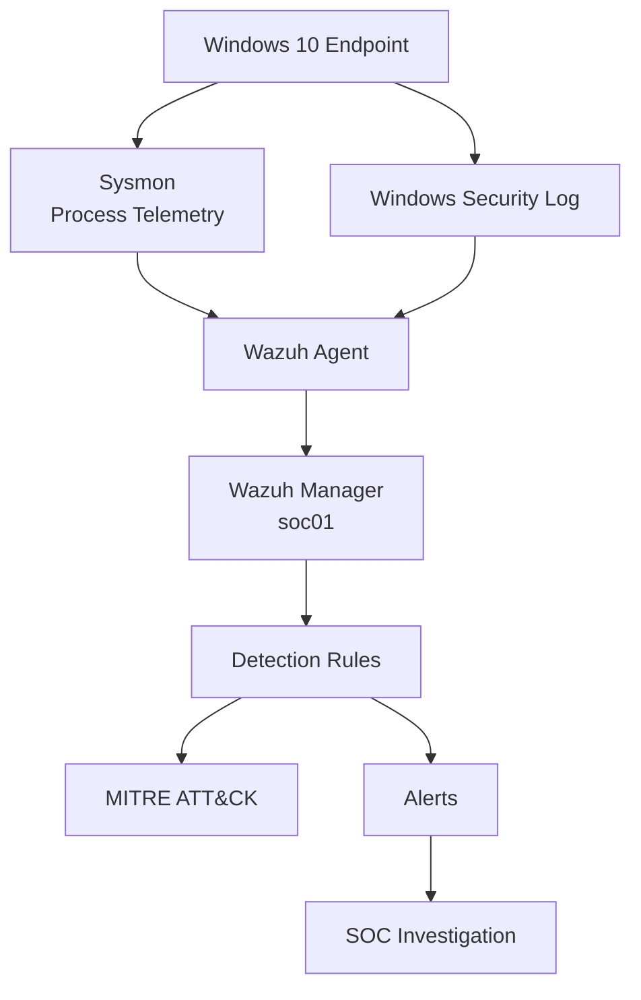

# SOC Blue Team Home Lab

Laboratório prático de Blue Team e Security Operations Center (SOC), desenvolvido para estudo de monitoramento, detecção, correlação de eventos, investigação e triagem de incidentes utilizando Wazuh, Sysmon, Windows Security Event Log e ferramentas auxiliares.

O projeto foi construído em ambiente virtualizado e documenta não apenas as detecções finais, mas também os testes, troubleshooting e decisões tomadas durante a implementação.

---

# Objetivos

Este laboratório tem como objetivos:

- desenvolver experiência prática em operações de SOC;
- compreender geração, coleta e análise de logs;
- trabalhar com telemetria de endpoints Windows;
- criar e testar regras de detecção;
- realizar correlação temporal de eventos;
- investigar árvores de processos;
- detectar falhas de autenticação e possíveis ataques de brute force;
- detectar password guessing;
- correlacionar falhas de autenticação com logons bem-sucedidos;
- utilizar MITRE ATT&CK para classificação de comportamento;
- realizar triagem de alertas;
- documentar casos de investigação;
- desenvolver pequenas ferramentas para auxiliar atividades de SOC.

---

# Arquitetura do Laboratório



---

# Ambiente

## Host

```text
Sistema: Windows 11
Virtualização: VirtualBox
```

## Wazuh Server

```text
Hostname: soc01
Sistema: Ubuntu Server 24.04
IP Host-Only: 192.168.100.10
Wazuh: 4.14.7
```

## Windows Endpoint

```text
Sistema: Windows 10
IP Host-Only: 192.168.100.20
Wazuh Agent: ativo
Sysmon: ativo
```

---

# Componentes

O laboratório atualmente utiliza:

- Windows 10
- Ubuntu Server
- Wazuh Manager
- Wazuh Agent
- Wazuh Dashboard
- Sysmon
- Windows Security Event Log
- PowerShell Logging
- Bash
- jq
- MITRE ATT&CK
- Git
- GitHub

---

# Sysmon + Wazuh

O Sysmon foi configurado no endpoint Windows para fornecer telemetria detalhada de processos e outras atividades do sistema.

Entre os eventos utilizados no laboratório estão:

```text
Event ID 1  - Process Create
Event ID 3  - Network Connection
Event ID 11 - File Create
Event ID 22 - DNS Query
```

O Event ID 1 é especialmente importante para investigação porque fornece informações como:

```text
ProcessGuid
ProcessId
Image
CommandLine
CurrentDirectory
User
IntegrityLevel
Hashes
ParentProcessGuid
ParentProcessId
ParentImage
ParentCommandLine
```

O Wazuh Agent coleta esses eventos e os envia ao Wazuh Manager para análise e aplicação das regras de detecção.

---

# PowerShell Monitoring

O laboratório também utiliza PowerShell Script Block Logging.

Foi validada a coleta de:

```text
Microsoft-Windows-PowerShell/Operational
Event ID 4104
```

Uma regra customizada foi criada para detectar um marcador utilizado durante testes controlados:

```text
Rule ID: 100100
Level:   10
MITRE:   T1059.001
```

---

# Custom Detection Rules

As regras customizadas são mantidas em:

```text
wazuh/rules/local_rules.xml
```

Atualmente o laboratório possui as seguintes regras principais.

---

## Rule 100100

Detecção de PowerShell Script Block contendo marcador de teste controlado.

```text
Rule ID: 100100
Level:   10
MITRE:   T1059.001
```

MITRE ATT&CK:

```text
T1059.001 - PowerShell
```

---

## Rule 100110

Detecta `cmd.exe` iniciado por PowerShell elevado.

```text
Rule ID: 100110
Level:   8
```

MITRE ATT&CK:

```text
T1059.003 - Windows Command Shell
```

---

## Rule 100120

Detecta execução de `whoami` dentro de um `cmd.exe` iniciado por PowerShell elevado.

```text
Rule ID: 100120
Level:   10
```

MITRE ATT&CK:

```text
T1033     - System Owner/User Discovery
T1059.003 - Windows Command Shell
```

---

## Rule 100130

Detecta múltiplos comandos de Discovery executados dentro do mesmo `cmd.exe`.

Comandos monitorados:

```text
whoami
hostname
ipconfig
net user
```

Regra:

```text
Rule ID: 100130
Level:   12
```

MITRE ATT&CK:

```text
T1033     - System Owner/User Discovery
T1016     - System Network Configuration Discovery
T1087.001 - Local Account
T1059.003 - Windows Command Shell
```

---

# Discovery Detection Scenario

Um cenário controlado foi executado com:

```cmd
cmd.exe /c "whoami && hostname && ipconfig && net user"
```

O processo foi iniciado a partir de uma sessão elevada do PowerShell.

O Wazuh gerou:

```text
Rule ID: 100130
Level:   12
```

A cadeia observada foi:

```text
powershell.exe
└── cmd.exe
    ├── whoami.exe
    ├── HOSTNAME.EXE
    ├── ipconfig.exe
    └── net.exe
        └── net1.exe
```

---

# Process Tree Investigation

A investigação de processos utiliza:

```text
ProcessGuid
ParentProcessGuid
```

Exemplo:

```text
powershell.exe
└── cmd.exe [Rule 100130 | L12]
    ├── whoami.exe [Rule 92032 | L3]
    ├── HOSTNAME.EXE [Rule 92032 | L3]
    ├── ipconfig.exe [Rule 92032 | L3]
    └── net.exe [Rule 92036 | L3]
        └── net1.exe [Rule 92031 | L3]
```

Documentação:

```text
docs/process-tree-investigation.md
```

---

# Process Tree Investigation Utility

Foi desenvolvida uma ferramenta em Bash para automatizar parte da investigação de árvores de processos.

Arquivo:

```text
scripts/process-tree.sh
```

Exemplos:

```bash
./scripts/process-tree.sh --rule 100130 --days 7 --summary
```

```bash
./scripts/process-tree.sh --rule 100130 --days 7 --report
```

Funcionalidades:

- pesquisa por ProcessGuid;
- pesquisa por Rule ID;
- reconstrução recursiva de processos filhos;
- correlação por `ProcessGuid` e `ParentProcessGuid`;
- consulta ao `alerts.json`;
- consulta aos históricos `ossec-alerts-*.json`;
- definição de janela temporal com `--days`;
- modo resumido com `--summary`;
- geração de relatório com `--report`;
- tratamento de linhas JSON inválidas ou incompletas;
- suporte à rotação de logs do Wazuh.

---

# SOC Triage Report

A ferramenta também pode gerar um relatório inicial de triagem.

Exemplo:

```bash
./scripts/process-tree.sh --rule 100130 --days 7 --report
```

Case:

```text
cases/case-100130-discovery.txt
```

Classificação:

```text
Classification: True Positive
Disposition: Close - Authorized Security Test
```

---

# Windows Authentication Monitoring

Foi implementado monitoramento de autenticação utilizando o Windows Security Event Log e o Wazuh.

Eventos principais:

```text
4625 - Failed Logon
4624 - Successful Logon
```

Campos importantes:

```text
targetUserName
targetDomainName
logonType
ipAddress
status
subStatus
authenticationPackageName
workstationName
```

Documentação completa:

```text
docs/windows-authentication-monitoring.md
```

---

# Rule 60122 - Individual Logon Failure

Uma tentativa de autenticação inválida gera:

```text
Event ID: 4625
```

Resultado de usuário inexistente:

```text
Account:     SOC-LAB-INVALID
Logon Type:  3
Source IP:   127.0.0.1
Status:      0xC000006D
SubStatus:   0xC0000064
```

No Wazuh:

```text
Rule ID:     60122
Level:       5
Description: Logon Failure - Unknown user or bad password
```

---

# Rule 60204 - Multiple Windows Logon Failures

A regra nativa 60204 correlaciona múltiplas falhas de autenticação:

```text
8 falhas
mesmo IP
até 240 segundos
```

Resultado:

```text
Rule ID:     60204
Level:       10
Description: Multiple Windows Logon Failures
MITRE:       T1110
Technique:   Brute Force
Tactic:      Credential Access
```

---

# Password Guessing Detection

## Rule 100135

A Rule 100135 identifica senha incorreta para uma conta existente:

```xml
<rule id="100135" level="6">
  <if_sid>60122</if_sid>
  <field name="win.eventdata.subStatus" type="pcre2">(?i)^0xc000006a$</field>
  <description>SOC LAB: Windows logon failure caused by incorrect password for an existing account.</description>
  <group>authentication_failed,password_failure,soc_lab,</group>
</rule>
```

O SubStatus:

```text
0xC000006A
```

representa senha incorreta para uma conta existente.

---

## Rule 100140

```xml
<rule id="100140" level="12" frequency="5" timeframe="60">
  <if_matched_sid>100135</if_matched_sid>
  <same_field>win.eventdata.targetUserName</same_field>
  <same_field>win.eventdata.ipAddress</same_field>
  <description>SOC LAB: Repeated password failures against the same Windows account from the same source IP.</description>
  <group>authentication_failed,brute_force,password_guessing,soc_lab,</group>
  <mitre>
    <id>T1110.001</id>
  </mitre>
</rule>
```

Critérios:

```text
5 falhas
mesmo usuário
mesmo IP
até 60 segundos
senha incorreta
conta existente
```

MITRE ATT&CK:

```text
T1110.001 - Password Guessing
Tactic: Credential Access
```

---

# Password Guessing Validation

Foram realizadas cinco tentativas de senha incorreta contra:

```text
WIN10\vboxuser
```

O Windows registrou:

```text
Event ID:   4625
Status:     0xC000006D
SubStatus:  0xC000006A
```

Resultado no Wazuh:

```text
1ª falha -> Rule 100135 | Level 6
2ª falha -> Rule 100135 | Level 6
3ª falha -> Rule 100135 | Level 6
4ª falha -> Rule 100135 | Level 6
5ª falha -> Rule 100140 | Level 12
```

Case:

```text
cases/case-100140-password-guessing.txt
```

---

# Successful Logon Monitoring

## Event ID 4624

Foi validado o evento:

```text
Event ID 4624
An account was successfully logged on
```

Os principais Logon Types analisados foram:

```text
Type 2  - Interactive
Type 3  - Network
Type 10 - RemoteInteractive / RDP
```

Nesta etapa foram validados diretamente os Types 2 e 3.

---

## Logon Type 2 - Interactive

Resultado:

```text
User:        vboxuser
Domain:      WIN10
Logon Type:  2
Source IP:   ::1
AuthPackage: Negotiate
```

No Wazuh:

```text
Rule ID:      60118
Level:        3
Description:  Windows Workstation Logon Success
```

---

## Logon Type 3 - Network

Foi gerado um logon de rede utilizando:

```powershell
net use \\127.0.0.1\IPC$ /user:WIN10\vboxuser *
```

Resultado:

```text
User:        vboxuser
Domain:      WIN10
Logon Type:  3
Source IP:   127.0.0.1
Workstation: WIN10
AuthPackage: NTLM
```

No Wazuh:

```text
Rule ID:      60106
Level:        3
Description:  Windows Logon Success
```

MITRE:

```text
T1078 - Valid Accounts
```

---

# Rule 100145 - Successful Network Logon

Foi criada uma regra intermediária para identificar logons de rede bem-sucedidos:

```xml
<rule id="100145" level="4">
  <if_sid>60106</if_sid>
  <field name="win.system.eventID">^4624$</field>
  <field name="win.eventdata.logonType">^3$</field>
  <description>SOC LAB: Successful Windows network logon.</description>
  <group>authentication_success,network_logon,soc_lab,</group>
  <mitre>
    <id>T1078</id>
  </mitre>
</rule>
```

Critérios:

```text
4624
+
Logon Type 3
=
Successful Network Logon
```

---

# Rule 100150 - Successful Logon After Password Guessing

A Rule 100150 correlaciona um logon bem-sucedido com uma ocorrência anterior da Rule 100140.

```xml
<rule id="100150" level="14" timeframe="300">
  <if_sid>100145</if_sid>
  <if_matched_sid>100140</if_matched_sid>
  <same_field>win.eventdata.targetUserName</same_field>
  <same_field>win.eventdata.ipAddress</same_field>
  <description>SOC LAB: Successful Windows network logon after repeated password guessing attempts.</description>
  <group>authentication_success,possible_account_compromise,password_guessing,soc_lab,</group>
  <mitre>
    <id>T1078</id>
  </mitre>
</rule>
```

A lógica final é:

```text
5 falhas
mesmo usuário
mesmo IP
até 60 segundos
↓
100140
Password Guessing
↓
4624 Type 3
mesmo usuário
mesmo IP
até 300 segundos
↓
100150
Successful Logon After Password Guessing
```

Resultado:

```text
Rule ID:      100150
Level:        14
User:         vboxuser
Source IP:    127.0.0.1
Logon Type:   3
MITRE:        T1078
Technique:    Valid Accounts
```

---

# Authentication Correlation Chain

```text
4625
↓
60122
↓
100135
↓
100140
T1110.001 - Password Guessing
↓
4624 Type 3
↓
100145
↓
100150
T1078 - Valid Accounts
```

---

# SOC Interpretation

A combinação:

```text
múltiplas falhas de senha
↓
logon bem-sucedido logo depois
```

é mais crítica do que falhas isoladas.

Em produção, esse padrão pode indicar que uma credencial foi descoberta ou comprometida.

Por isso, a Rule 100150 foi definida como:

```text
Level 14
```

para representar alta prioridade de investigação.

---

# Authentication Case Triage

O cenário foi classificado como:

```text
Classification: True Positive
Disposition: Close - Authorized Security Test
```

Case:

```text
cases/case-100150-success-after-password-guessing.txt
```

Em produção, a investigação recomendada incluiria:

- usuário afetado;
- origem do acesso;
- histórico de autenticação;
- dispositivo utilizado;
- eventos posteriores ao logon;
- processos iniciados;
- alterações de privilégio;
- movimentação lateral;
- persistência;
- atividade de rede.

---

# MITRE ATT&CK Coverage

As principais técnicas trabalhadas até o momento são:

| Technique | Description |
|---|---|
| T1059.001 | PowerShell |
| T1059.003 | Windows Command Shell |
| T1033 | System Owner/User Discovery |
| T1016 | System Network Configuration Discovery |
| T1087.001 | Local Account |
| T1110 | Brute Force |
| T1110.001 | Password Guessing |
| T1078 | Valid Accounts |

---

# Project Structure

```text
soc-blue-team-homelab/
│
├── README.md
├── .gitignore
│
├── cases/
│   ├── case-100130-discovery.txt
│   ├── case-100140-password-guessing.txt
│   └── case-100150-success-after-password-guessing.txt
│
├── docs/
│   ├── process-tree-investigation.md
│   └── windows-authentication-monitoring.md
│
├── scripts/
│   └── process-tree.sh
│
└── wazuh/
    └── rules/
        └── local_rules.xml
```

---

# Current Detection Flow

```text
Windows Endpoint
      |
      +---- Sysmon
      |       |
      |       +---- Process Creation
      |       +---- Process Tree
      |       +---- Discovery Detection
      |
      +---- Security Event Log
              |
              +---- 4625 Failed Logon
              |        |
              |        +---- 60122
              |        +---- 60204
              |        +---- 100135
              |        +---- 100140
              |
              +---- 4624 Successful Logon
                       |
                       +---- 60106 / 60118
                       +---- 100145
                       +---- 100150
                              |
                              v
                     Possible Account Compromise
```

---

# Troubleshooting Performed

Durante o desenvolvimento foram investigados e resolvidos problemas relacionados a:

- instalação do Wazuh Agent;
- comunicação entre endpoint e Wazuh Manager;
- configuração de Sysmon;
- excesso de eventos Sysmon;
- ajuste de Registry Events;
- coleta de PowerShell;
- criação de regras customizadas;
- sintaxe XML de regras Wazuh;
- correlação por `ProcessGuid`;
- reconstrução de árvores de processos;
- rotação de logs do Wazuh;
- arquivos JSON incompletos durante leitura;
- consultas com `jq`;
- correlação temporal;
- `frequency`;
- `timeframe`;
- `same_field`;
- diferenças entre usuário inexistente e senha incorreta;
- interação entre regras customizadas e regras nativas de correlação;
- autenticação SMB com erro 1219;
- diferenciação entre Logon Type 2 e 3;
- correlação entre falhas e sucesso de autenticação.

---

# Status

Implementado:

```text
[OK] Wazuh Manager
[OK] Windows Wazuh Agent
[OK] Sysmon
[OK] PowerShell Logging
[OK] Sysmon Event ID 1 investigation
[OK] ProcessGuid correlation
[OK] ParentProcessGuid correlation
[OK] Custom Wazuh detection rules
[OK] Discovery detection
[OK] Process Tree reconstruction
[OK] Historical Wazuh alert investigation
[OK] SOC Triage Report
[OK] Windows Event ID 4625 monitoring
[OK] Individual authentication failure detection
[OK] Multiple Windows logon failure detection
[OK] Password Guessing detection
[OK] Windows Event ID 4624 monitoring
[OK] Logon Type 2 analysis
[OK] Logon Type 3 analysis
[OK] Successful network logon detection
[OK] Failed-to-successful authentication correlation
[OK] Possible account compromise detection
[OK] Temporal correlation
[OK] MITRE ATT&CK mapping
```

---

# Next Steps

Próximas evoluções previstas:

- Event ID 4740 - Account Lockout;
- account lockout correlation;
- Logon Type 10 analysis;
- RDP authentication monitoring;
- RDP brute force detection;
- successful RDP logon after failures;
- Windows Server integration;
- Active Directory;
- privileged logon monitoring;
- privilege escalation detection;
- persistence scenarios;
- Windows Defender integration;
- malware monitoring;
- Suricata;
- Zeek;
- network telemetry;
- lateral movement scenarios;
- threat hunting;
- additional SOC investigation cases.

---

# Disclaimer

Todos os testes presentes neste projeto foram realizados em ambiente controlado e de laboratório.

Os comandos, regras e técnicas documentados têm finalidade exclusivamente educacional, voltada ao estudo de:

- Blue Team;
- SOC;
- SIEM;
- Detection Engineering;
- Threat Hunting;
- DFIR;
- Cybersecurity.

Nenhum dos testes descritos deve ser executado em sistemas ou redes sem autorização.

